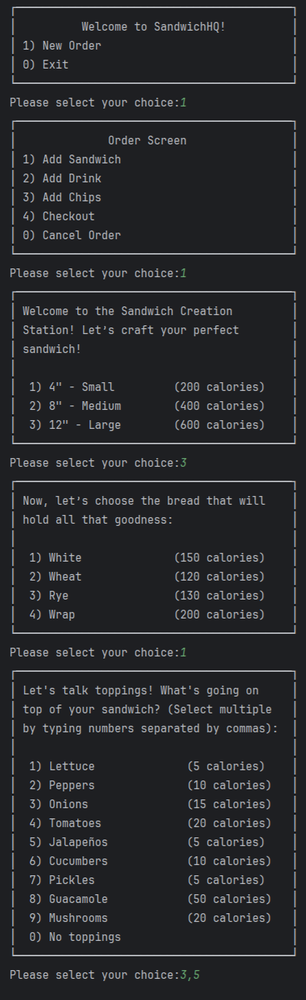
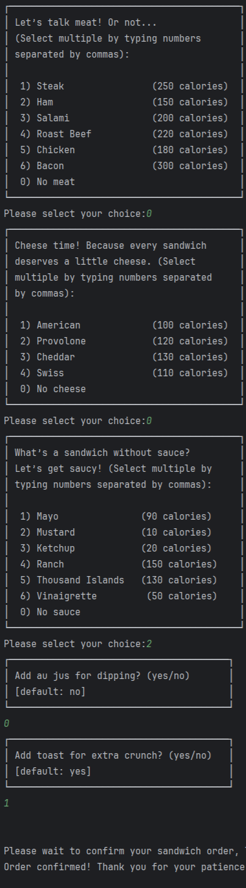
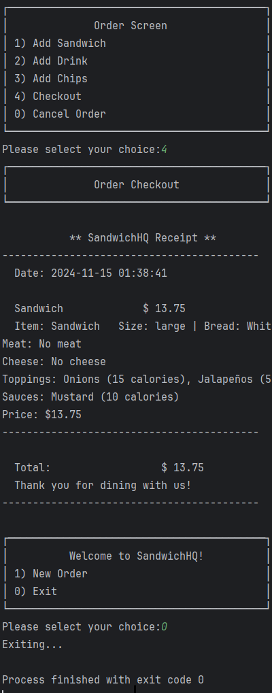

# SandwichHQ - Point of Sale (POS) System

## Overview

**SandwichHQ** is a point of sale (POS) system designed for a sandwich shop. It allows users to create and customize sandwich orders, calculate the prices based on selected options, and generate detailed receipts. The system includes the following features:
- Sandwich customization (size, toppings, extra meat, cheese, etc.)
- Drink and chips ordering
- Dynamic receipt generation and file saving
- Displaying the receipt in a user-friendly interface

## Features

- **Sandwich Customization**: Choose the size, bread, meats, cheese, toppings, and sauces. Prices change depending on selected options.
- **Order Calculation**: Prices are dynamically calculated based on the sandwich size, toppings, extra meats, and cheese selections.
- **Drink and Chips Ordering**: A selection of drink sizes and chips are also available, with prices based on the size of the drink.
- **Receipt Generation**: After the checkout, a detailed receipt is shown to the user on the interface and saved as a text file.
- **User Interface (UI)**: The user interface is designed using Java Swing to allow easy ordering and viewing of receipts.

## Project Structure
Coming ...

### Key Classes

1. **PricingManager.java**:
   - Contains all pricing details for sandwiches, drinks, and chips.
   - Methods to get prices based on sandwich size, toppings, drink size, and more.

2. **SandwichHQItem.java**:
   - Represents an item in the order (e.g., sandwich, drink, chips).
   - Includes a `receipt()` method to format the order details into a string for the receipt.

3. **HQ_UserInterface.java**:
   - Manages file saving and receipt generation.
   - The `createAndShowOrderReceipt()` method writes the receipt to a text file and displays it in the UI using a `JTextArea`.

4. **SandwichHQUI.java**:
   - The main UI for the SandwichHQ system.
   - Allows users to add items to their order, view the total, and checkout.
   - Displays the receipt in a scrollable text area and saves it to a file.

## Setup Instructions

### Requirements:
- Java Development Kit (JDK) 8 or higher.
- An IDE (e.g., IntelliJ IDEA, Eclipse, or Visual Studio Code) for compiling and running the project.

### Steps to Run the Application:

1. **Clone or Download the Project**:
   - Clone the repository or download the files to your local machine.

2. **Compile the Project**:
   - Open the project in your preferred IDE or use the command line to compile the Java files:
     ```
     javac -d bin src/com/pluralsight/*.java
     ```

3. **Run the Application**:
   - Once the project is compiled, run the `SandwichHQUI.java` class to start the application:
     ```
     java com.pluralsight.SandwichHQUI
     ```

4. **Place Orders**:
   - Use the interface to create orders. You can select sandwich options, drink sizes, and chips.
   - Press the "Checkout" button to view the receipt in the `JTextArea` and save it as a `.txt` file in the `./order/` directory.

### Example Output:
- When the checkout is complete, a file named `yyyyMMdd-HHmmss.txt` will be generated in the `./order/` directory.
- The receipt displayed in the UI will contain the order details, itemized prices, and a total amount.

## Folder Structure
       src
         └── main
            └── java
               └── comp-pluralsight
                  ├── core
                  │   ├── IReceiptDescription.java
                  │   ├── Order.java
                  │   ├── SandwichHQItem.java
                  │   └── UserInterface.java
                  ├── file_management
                  │   └── ReceiptFileHandler.java
                  ├── menu
                  │   ├── Chips.java
                  │   ├── Drink.java
                  │   └── Sandwich.java
                  ├── pricing
                  │   └── PricingManager.java
                  └── utils
                  │    └── HelperFunction.java
                  └── Program.java

## UI






## Application Flow


## Contributions

Feel free to contribute to this project. You can:
- Fork the repository.
- Submit a pull request with your changes.
- Report issues or suggest new features via GitHub Issues.

## License
This project is licensed under the MIT License. See the [LICENSE](https://choosealicense.com/licenses/mit/) file for more details.


## 🚀 About Me
I'm a developer...
Find me in  [Linkedln](https://www.linkedin.com/in/obaid-sidiqi/)
